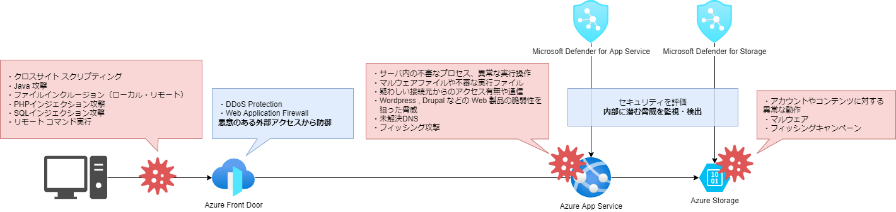

# Web アプリケーションに対する脅威と対策

- [Web アプリケーションに対する脅威と対策](#web-アプリケーションに対する脅威と対策)
  - [概要](#概要)
  - [脅威](#脅威)
    - [Azure App Service に対する脅威](#azure-app-service-に対する脅威)
    - [Azure Storage に対する脅威](#azure-storage-に対する脅威)
  - [クラウドにおけるセキュリティ対策の考え方](#クラウドにおけるセキュリティ対策の考え方)
    - [Microsoft Defender for Cloud](#microsoft-defender-for-cloud)
    - [Web Application Firewall (WAF)](#web-application-firewall-waf)
  - [本ドキュメントで取り上げる脅威対策](#本ドキュメントで取り上げる脅威対策)

## 概要

Azure App Service 等の PaaS はOSやミドルウェアなどの管理をクラウドベンダーが担っています。だからと言って Web アプリケーションのセキュリティ対策は不要だというわけではありません。設定の不備を突かれてサイバー攻撃を受けてしまうこともありますし、脆弱性を突かれて不正にシステムに侵入されてしまうこともあります。

本章では、下図のように Azure の PaaS で構成された Web アプリケーションに発生しうる脅威とその対策をご紹介します。

## 脅威

### Azure App Service に対する脅威

図にある通り Azure App Service には主に次のような脅威が想定されます。

- 悪意のある外部アクセスからの脅威
  - クロスサイト スクリプティング
  - Java 攻撃
  - ファイルインクルージョン（ローカル・リモート）
  - PHP インジェクション攻撃
  - SQL インジェクション攻撃
  - リモートコマンド実行
- 内部に潜む脅威
  - サーバ内の不審なプロセス、異常な実行操作の検知
  - マルウェアファイルや不審な実行ファイルの検知
  - 疑わしい接続元からのアクセス有無や通信の検知
  - Wordpress , Drupal などの Web 製品の脆弱性を狙った脅威の検知

具体的には以下のような事例が挙げられます。

- [サブドメインの乗っ取り](https://msrc-blog.microsoft.com/2020/10/27/20201027_subdomaintakeover/)を利用した攻撃
- Wordpress の設定不備による攻撃者が用意したphp ファイルの実行
- アプリケーションの脆弱性による [OS コマンドインジェクション](https://www.ipa.go.jp/security/vuln/websecurity-HTML-1_2.html)

### Azure Storage に対する脅威

世の中の攻撃者はシステムが管理するデータを狙い攻撃をします。 脅威は Azure App Service に対してだけではなく、 Azure App Service が利用するコンテンツを保持するストレージに対しても存在します。

Azure Storage に対する脅威は大きく分けて以下の三つが挙げられます。

- 機密データが漏洩したり、削除される
- マルウェアがアップロードされ、拡散される
- 公開データがフィッシング攻撃に利用される

## クラウドにおけるセキュリティ対策の考え方

PaaS をはじめとする様々なクラウドサービスにはクラウドサービスプロバイダ（ Microsoft Azure ）とサービス利用者（ユーザ）との責任境界線があり、ユーザはその責任領域を理解して利用する必要があります。
パブリッククラウドのセキュリティ対策はそれに基づいて分担することになります。

【PaaS の責任境界線モデル】  
  
参考：<https://docs.microsoft.com/ja-jp/azure/security/fundamentals/shared-responsibility>

PaaS における責任境界線モデルに基づくと、ユーザ自身で責任をもって管理する領域は下記の項目になります。

- データ
- エンドポイント
- アカウント
- アクセス管理

PaaS に展開したアプリケーションのインフラストラクチャー層はクラウドサービスプロバイダによって保護されますが、ユーザが管理する領域＝アプリケーション層についてはユーザ自身で責任を持って保護しなければなりません。

Azure App Service にアプリケーションを展開する時は次の脅威についてリスクを検討しセキュリティ対策を行う必要があります。

- アプリケーションの脆弱性を狙った脅威への対策
- データの保護
- エンドポイントの脅威の対策  

Azure App Service に対する脅威は前述したとおり「内部に潜む脅威」と「悪意のある外部アクセスからの脅威」があります。特に内部に潜む脅威の一つであるアプリケーションの脆弱性は、調査に要する時間や金銭的コストに起因して発見が遅れることも多く、脅威対策に障壁があると言えるでしょう。

脅威対策の仕組みはいくつかありますが、 Azure のサービスを利用している場合には Azure から提供されている脅威対策の仕組みを利用するのが一番容易かつ適しているでしょう。「 Microsoft Defender for Cloud 」というサービスを利用すれば内部に潜む脅威への対策を実施できます。

### Microsoft Defender for Cloud

Microsoft Defender for Cloud はクラウドセキュリティ体制管理とワークロード保護機能を備える、Azureユーザのセキュリティ対策を支える中心的なサービスです。  
以下の3つの重要なニーズを満たします。

- 継続的なセキュリティ評価
  - 現在のセキュリティの状態を評価します。評価結果はセキュリティスコアとして算出され、現在のセキュリティの状況を一目で確認することができます。スコアが高くなるほど、識別されたリスク レベルが低下します。
- セキュリティ保護
  - 接続されているリソースやサービスのセキュリティに関する推奨事項が優先順位付けされて提供されます。推奨事項に記載されている手順に従って体制を改善することで、セキュリティが強化されます。また"修正"ボタンをクリックすることで自動的に推奨事項を適用する機能もあります。
- 脅威の検出と防御
  - リソースやサービス、ワークロードに対する脅威を検出し、アラートを Azure Portal など任意の通知先に送ります。

つまり Microsoft Defender for Cloud は適用したサービスを「評価」し、よりセキュリティが強固になるよう「対策を提案」し、脅威を検出して「防御」してくれるサービスです。詳細は公式ドキュメント「[Microsoft Defender for Cloud とは](https://docs.microsoft.com/ja-jp/azure/defender-for-cloud/defender-for-cloud-introduction) 」を、 Microsoft Defender for Cloud を有効化する場合は「[クイックスタート: 強化されたセキュリティ機能を有効にする](https://docs.microsoft.com/ja-jp/azure/defender-for-cloud/enable-enhanced-security)」をご参照ください。

### Web Application Firewall (WAF)

悪意のある外部からのアクセスによる脅威から Web アプリケーションを保護する手段としては、Web Application Firewall (WAF)が挙げられれます。外部から Web アプリケーションへアクセスするルートの中にチェックポイントを置いておき、悪意のある攻撃かどうかを検出してくれるものです。構成としてはゲートウェイがチェックポイントとして利用されることがほとんどです。

Azure においてWAF は以下のゲートウェイサービスに付属されています。これらのサービスを利用している箇所では WAF を利用することが可能です。

- Azure Front Door
- Azure Application Gateway

## 本ドキュメントで取り上げる脅威対策

Microsoft Defender for Cloud のうち「 Microsoft Defender for App Service 」と「 Microsoft Defender for Storage 」が Azure App Service および Azure Storage に関するサービスです。これらのサービスについて次の章から詳しくご紹介します。  
さらに Azure App Service に WAF を適用する手段として Azure Front Door を利用する方法についてもご紹介します。
