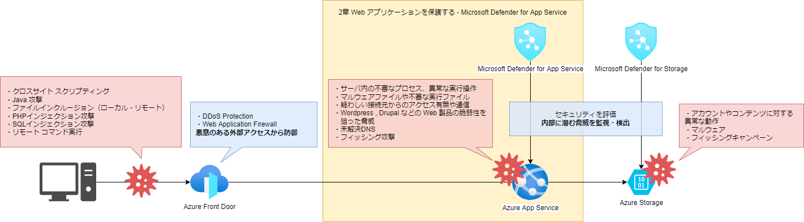

# Webアプリケーションを保護する - Microsoft Defender for App Service

- [Webアプリケーションを保護する - Microsoft Defender for App Service](#webアプリケーションを保護する---microsoft-defender-for-app-service)
  - [概要](#概要)
  - [検知可能な脅威](#検知可能な脅威)
    - [検知できるようにしておきたいアラート](#検知できるようにしておきたいアラート)
      - [サーバ内の不審なプロセス、異常な実行操作の検知](#サーバ内の不審なプロセス異常な実行操作の検知)
      - [未解決DNSの検知](#未解決dnsの検知)
      - [フィッシング攻撃の検知](#フィッシング攻撃の検知)
  - [テストアラートの生成](#テストアラートの生成)

## 概要

Microsoft Defender for App Service は Azure App Service のワークロードを評価し、セキュリティ上の推奨事項の生成や脅威を検出するセキュリティ機能です。本機能の概要についてはこちらの [Microsoft の公式ドキュメント](https://docs.microsoft.com/ja-jp/azure/defender-for-cloud/defender-for-app-service-introduction) を参照ください。  

脅威検出には Microsoft 脅威検出インテリジェンスが用いられます。 Microsoft が提供する Web サービスは膨大で、それらの Web サービスのために蓄積された知見を利用できるということは大きなメリットです。脅威検出以外の機能として、適用された Azure App Service の脆弱性の評価と推奨される対応も提供します。現実的な課題解決のためのソリューションの1つとして積極的に利用することをお勧めします。

Microsoft Defender for App Service は Microsoft Defender for Cloud の中の一部のサービスです。 Microsoft Defender for Cloud はサブスクリプション単位のサービスとなるため、 有効化することでサブスクリプション内全ての Azure App Service が保護されます。 Microsoft Defender for Cloud を有効化する場合はこちらのドキュメント「[クイックスタート: 強化されたセキュリティ機能を有効にする](https://docs.microsoft.com/ja-jp/azure/defender-for-cloud/enable-enhanced-security)」をご参照ください。

## 検知可能な脅威

Azure App Service を使用して Web アプリケーションを展開している場合、攻撃者は外部から Web アプリケーションの脆弱性等を探し出し、そこを狙って攻撃を仕掛けようとしてきます。攻撃を受けた場合は直ちに対処をしなければなりませんが、脅威に晒されている状況に早く気付けるように備えておく必要があります。

Microsoft Defender for App Service は以下の例のような脅威に対して検知することが可能です。  

- サーバ内の不審なプロセス、異常な実行操作
- マルウェアファイルや不審な実行ファイル
- 疑わしい接続元からのアクセス有無や通信
- Wordpress , Drupal などの Web 製品の脆弱性を狙った脅威
- 未解決DNS
- フィッシング攻撃

### 検知できるようにしておきたいアラート

ここでは[Microsoft Defender for App Service のアラート](https://docs.microsoft.com/ja-jp/azure/defender-for-cloud/alerts-reference#alerts-azureappserv)の中から3つのタイプを抜粋してご紹介します。

#### サーバ内の不審なプロセス、異常な実行操作の検知

- An attempt to run Linux commands on a Windows Azure App Service (Windows Azure App Service での Linux コマンドの実行試行)(AppServices_LinuxCommandOnWindows)
- Attempt to run high privilege command detected (高い特権のコマンドの実行試行が検出されました)(AppServices_HighPrivilegeCommand)

ウェブアプリケーションの脆弱性として一般的な OS コマンドインジェクションに関するアラートです。
 Microsoft Defender for App Service はアプリケーション内部で起きている脅威についても Azure App Service のプロセスを分析し検知することが可能です。  
また WAF と組み合わせることでアプリケーション内部と外部からの脅威対策を行うことも検討しましょう。

#### 未解決DNSの検知

- Dangling DNS record for an Azure App Service resource detected (Azure App Service リソースの未解決の DNS レコードが検出されました)(AppServices_DanglingDomain)
- Potential dangling DNS record for an Azure App Service resource detected (Azure App Service リソースに対する潜在的な未解決の DNS レコードが検出されました)(AppServices_PotentialDanglingDomain)

 [サブドメインの乗っ取り](https://msrc-blog.microsoft.com/2020/10/27/20201027_subdomaintakeover/)に対してのアラートです。  
サブドメインの乗っ取りによる攻撃はAzureの領域内に限らず度々問題になっています。  
ドメインの管理はユーザの責任範囲ですが、 Microsoft Defender for App Service はサブドメインの乗っ取りによる脅威について検知できます。

#### フィッシング攻撃の検知

- Phishing content hosted on Azure Webapps (Azure Webapps でホストされているコンテンツのフィッシング)(AppServices_PhishingContent)

Microsoft Defender for App Service はフィッシング攻撃に利用されている事を検知することが可能です。

## テストアラートの生成

特定の URL にアクセスすることでテストアラートを生成することができます。
その手順をご紹介します。

① Microsoft Defender for Cloud の環境設定画面からサブスクリプションを選択します。

② Azure App Service をオンにします。

③ アラートを起こしたい Azure App Service の設定でDefenderがオンになっているか確認します。
対象の Azure App Service のセキュリティ画面から確認できます。

④ Azure App Service のURLの末尾に */This_Will_Generate_ASC_Alert* を付けてアクセスするとテスト用のアラートを生成させることができます。

**※テスト用なので実際の脅威ではありません。**

App Service のリソース名が"hogehoge"の場合

><https://hogehoge.azurewebsites.net/This_Will_Generate_ASC_Alert>

になります。

URLは対象のリソースの概要ページからも確認できます。

⑤ 対象の Azure App Service のセキュリティ画面でアラートが確認できます。

⑥ Microsoft Defender for Cloud のセキュリティ警告画面でもアラートが確認できます。

⑦ 確認したいアラートをクリックすることで詳細を確認できます。

⑧ 全ての詳細を表示することで更に詳しい情報を確認できます。

⑨ アクションの実行を表示すれば脅威に対するアクションが確認できます。

