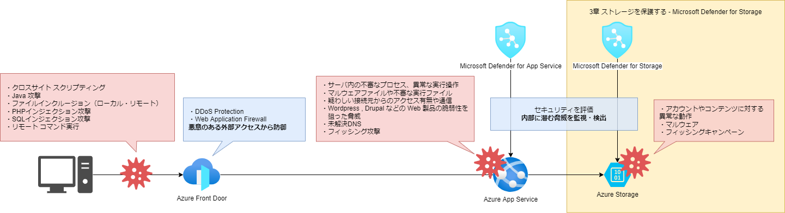
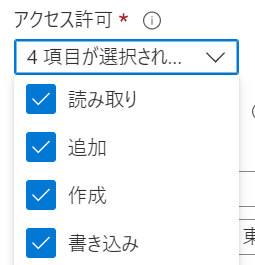

# ストレージを保護する - Microsoft Defender for Storage

- [ストレージを保護する - Microsoft Defender for Storage](#ストレージを保護する---microsoft-defender-for-storage)
  - [概要](#概要)
  - [検知可能な脅威](#検知可能な脅威)
    - [検知できるようにしておきたいアラート](#検知できるようにしておきたいアラート)
      - [ハッシュ評価ベースのマルウェア検出](#ハッシュ評価ベースのマルウェア検出)
      - [アカウントへの異常なアクセス](#アカウントへの異常なアクセス)
      - [通常とは異なるファイルのアップロード](#通常とは異なるファイルのアップロード)
  - [テストアラートの生成](#テストアラートの生成)
    - [テストファイル](#テストファイル)
    - [テストファイルのアップロード](#テストファイルのアップロード)
    - [SAS トークンを発行し、Azure Cloud Shell を使ってアップロード](#sas-トークンを発行しazure-cloud-shell-を使ってアップロード)

## 概要

攻撃の手段は様々ですが、データを守るためには CIA(完全性、機密性、可用性)に沿って対策を講じる必要があります。  
 Azure Storage の標準機能だけでも多くの脅威からデータが守られていますが、進化する攻撃者の技術の前では慎重に構える必要があります。  
管理するデータおよびシステムの性質をもとに脅威についてリスクを評価し、必要に応じて Microsoft Defender for Storage を利用しましょう。  
Microsoft Defender for Storage はストレージのワークロードを保護するセキュリティ機能です。
本機能の概要についてはこちらの [Microsoft の公式ドキュメント](https://docs.microsoft.com/ja-jp/azure/defender-for-cloud/defender-for-storage-introduction) を参照ください。

Microsoft Defender for Storage は Microsoft Defender for Cloud の一部のサービスです。 Microsoft Defender for Cloud はサブスクリプション単位のサービスとなるため、有効化することでサブスクリプション内全ての Azure Storage が保護されます。  
Microsoft Defender for Cloud を有効化する場合は下記のドキュメントをご参照ください。

[クイックスタート: 強化されたセキュリティ機能を有効にする](https://docs.microsoft.com/ja-jp/azure/defender-for-cloud/enable-enhanced-security)

特定の Azure Storage を保護対象から除外したい場合は下記のドキュメントをご参照ください。

[Microsoft Defender for Storage 保護からストレージ アカウントを除外する](https://docs.microsoft.com/ja-jp/azure/defender-for-cloud/defender-for-storage-exclude?tabs=enable-storage-protection-ps)

## 検知可能な脅威



ストレージサービスは様々な用途で使用される、価値の高いデータが保管されている場所です。攻撃を受けた場合は直ちに対処をしなければなりませんが、脅威に晒されている状況に早く気付けるように備えておく必要があります。  
Microsoft Defender for Storage は様々な脅威に対して検知することが可能です。

[Azure Storage のアラート](https://docs.microsoft.com/ja-jp/azure/defender-for-cloud/alerts-reference#alerts-azurestorage)

例として以下のような脅威の検知が可能です。

- アカウントへの異常なアクセス
- アカウントでの異常な動作
- ハッシュ評価ベースのマルウェア検出
- 通常とは異なるファイルのアップロード
- パブリックの可視性
- フィッシング キャンペーン

### 検知できるようにしておきたいアラート

ここでは[Microsoft Defender for Storage のアラート](https://docs.microsoft.com/ja-jp/azure/defender-for-cloud/alerts-reference#alerts-azurestorage)の中から3つのタイプを抜粋してご紹介します。

#### ハッシュ評価ベースのマルウェア検出

- Potential malware uploaded to a storage account (マルウェアがストレージ アカウントにアップロードされた可能性)(Storage.Blob_MalwareHashReputationStorage.Files_MalwareHashReputation)

ストレージにマルウェアファイルがアップロードされたことを検知したアラートです。  
Microsoft Defender for Storage がストレージ内のファイルを自動的に検証しマルウェアファイルが検出された時に知らせてくれるため、ユーザが任意のファイルをストレージにアップロードすることが可能なアプリケーション等の代表的なユースケースにおけるマルウェアファイルの脅威対策として有効です。

#### アカウントへの異常なアクセス

- Publicly accessible storage containers successfully discovered (パブリックにアクセス可能なストレージ コンテナーの検出に成功しました)(Storage.Blob_OpenContainersScanning.SuccessfulDiscovery)

スキャン等の偵察攻撃によってパブリックアクセスが可能なコンテナが検出をされた事を検知したアラートです。  
脅威アクターはアクセス可能なファイルを見つけたことで次の攻撃に移る可能性が高くなります。この時機密情報を含むストレージが公開されていた場合、情報漏洩事故に繋がります。  
設定誤り等の理由で意図せずストレージを公開してしまうことは誰にでも起こりえることです。

#### 通常とは異なるファイルのアップロード

- Unusual upload of .exe to a storage account (ストレージ アカウントへの .exe の通常と異なるアップロード)(Storage.Blob_ExeUploadAnomalyStorage.Files_ExeUploadAnomaly)

最近のアクティビティと比較して通常とは異なる方法で実行ファイルのアップロードされたことを検知したアラートです。  
Microsoft Defender for Storage は過去のアクティビティと比較して通常とは異なるアクティビティを識別することが可能です。

## テストアラートの生成

アンチウイルスソフトウェアでも利用されるテストファイルを利用して、アラートを生成することができます。  
その手順をご紹介します。

**アラートの設定方法や確認方法は本ドキュメントの Microsoft Defender for App Service のページを参考にしてください。**

### テストファイル

本物のマルウェアを使うのは問題があるので、EICAR テストファイルというアンチウイルスソフトウェアのテスト用のファイルを使います。
アンチウイルスソフトウェアの機能をテストする目的で作られている、実際は無害なファイルです。
ローカル環境でもアンチウイルスソフトウェアが有効な場合は警告やファイルの削除などが行われるので注意してください。

[Download Anti Malware Testfile – Eicar](https://www.eicar.org/?page_id=3950)

### テストファイルのアップロード

ローカル環境でアンチウイルスソフトウェアを無効にすることができれば、Azure Storage Explorerなどでアップロードすることができます。
もし、無効にすることができないのであれば以下の方法をお試しください。

### SAS トークンを発行し、Azure Cloud Shell を使ってアップロード

① アップロードしたいストレージアカウントのコンテナーのページに移動します。


② 以下を参考にアクセス許可欄を設定し、アップロードができるようにします。



③ SAS トークンおよび URL を生成をクリックし、 URL をコピーしておきます。

④ ポータル画面の上部から Azure Cloud Shell を起動し、以下のコマンドを実行します。

※ Azure Cloud Shell の初回起動時の設定は[こちら](https://docs.microsoft.com/ja-jp/azure/cloud-shell/persisting-shell-storage)を参考にしてください。

```bash
wget https://secure.eicar.org/eicar.com

azcopy cp eicar.com "コピーしたURL"
```

⑤ アップロードが成功した後しばらくするとアラートが生成されます。アラートが確認出来たらストレージアカウントのコンテナーページからファイルを削除します。
