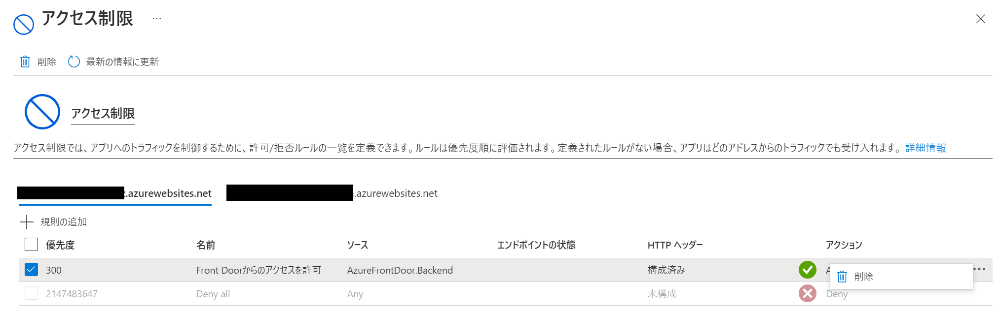

# 外部攻撃から保護する - Azure Front Door + Web Application Firewall

- [外部攻撃から保護する - Azure Front Door + Web Application Firewall](#外部攻撃から保護する---azure-front-door--web-application-firewall)
  - [概要](#概要)
  - [脅威対策の観点から見た Azure Front Door](#脅威対策の観点から見た-azure-front-door)
  - [Azure Front Door を利用して Azure App Service に WAF を有効化する](#azure-front-door-を利用して-azure-app-service-に-waf-を有効化する)
    - [設定変更箇所・手順](#設定変更箇所手順)
    - [確認方法](#確認方法)
    - [クリーンアップ](#クリーンアップ)

## 概要

Azure Front Door を経由してアプリケーションへアクセスさせることで、 DDoS Protection (Basic/Standard) と WAF によってアプリケーションを保護することもできます。  
本章では Azure App Service のセキュリティ性を向上させるという観点で Azure Front Door をご紹介します。  
Azure Front Door の詳細を知りたい方は [Azure Front Door ドキュメント](https://docs.microsoft.com/ja-jp/azure/frontdoor/front-door-overview)を参照してください。

## 脅威対策の観点から見た Azure Front Door

インターネット上に公開されるWebアプリケーションには以下のような脅威があります。

- クロスサイト スクリプティング
- Java 攻撃
- ローカル ファイル インクルージョン
- PHP インジェクション攻撃
- SQL インジェクション攻撃
- リモートコマンド実行

WAF （Web Application Firewall）を導入することによりこれらの攻撃を防ぐことができます。 Azure Front Door には WAF の機能が備わっており、この他にも様々な脅威を検出することが可能です。詳細は[Web Application Firewall の DRS 規則グループと規則](https://docs.microsoft.com/ja-jp/azure/web-application-firewall/afds/waf-front-door-drs)を参照してください。

Azure Front Door で WAF を利用する場合のコストはさほど高くなく、脅威対策という観点から見ても費用対効果が高いサービスといえます。 Azure App Service を利用して Web アプリケーションを公開している場合は、 Azure Front Door で WAF を有効化することを推奨します。  
Azure Front Door には既定のルールセットがありますが、カスタム ルールセットを使用することでそれぞれの Web アプリケーションに合わせてカスタマイズすることも可能です。

## Azure Front Door を利用して Azure App Service に WAF を有効化する

Azure Front Door を利用して Azure App Service に WAF を有効化する場合、外部からのトラフィックはすべてAzure Front Door（及びWAF）を通過させる必要があります。そのため保護対象のリソースのエンドポイントを外部からアクセスできないように構成します。

### 設定変更箇所・手順

① Azure Front Door と Azure App Serviceを 作成し、 Azure Front Door を介して特定のホストから Azure App Service にアクセスできるよう構成します。
構成についての詳細な手順は[アプリケーション用のフロント ドアを作成する](https://docs.microsoft.com/ja-jp/azure/frontdoor/quickstart-create-front-door#create-a-front-door-for-your-application)を参照してください。

② 作成した Azure App Service のアクセス制限に、規則を追加します。

③ ソースの設定 - 種類で「サービスタグ」を選択します。

サービスタグとはAzureサービス同士が通信するときに利用されるサービス独自の IP アドレスグループをまとめたものです。 IP アドレスは Azure の仕様変更などで変わる可能性があるので、「この Azure サービスからのアクセスを許可したい」という用途ではサービスタグを利用する方が良いでしょう。
詳細は[仮想ネットワーク サービス タグ](https://docs.microsoft.com/ja-jp/azure/virtual-network/service-tags-overview)を参照してください。

④ ソースの設定 - サービス タグで「AzureFrontDoor.Backend」を選択します。

Azure Front Door のサービスタグには以下の3種類があります。

| サービスタグ              | 説明                                                                               |
| ------------------------- | ---------------------------------------------------------------------------------- |
| AzureFrontDoor.Frontend   | クライアントがAzure Front Doorに接続するときに使用するIPアドレスの一覧             |
| AzureFrontDoor.Backend    | Azure Front Doorがバックエンドサービスに接続するときに使用するIPアドレスの一覧     |
| AzureFrontDoor.FirstParty | AzureAzure Front Doorが他のAzureサービスと内部的に統合するための追加のサービスタグ |

今回は Azure Front Door からバックエンドサービス（ Azure App Service ）への接続の規則になるため、「AzureFrontDoor.Backend」を選択します。

④ Azure Front Door の概要にある「フロント ドア ID」をX-Azure-FDIDに設定します。

⑤ 「規則の追加」をクリックして完了です。

### 確認方法

① Azure App Service のURLに直接アクセスします。設定前は直接アクセスできましたが、設定後ではアクセスができなくなっています。

【設定前】

【設定後】

② Azure Front Door で指定したホストにアクセスします。こちらは設定前も設定後もアクセスできます。

【設定前・後】

### クリーンアップ

クリーンアップする際は Azure App Service のアクセス制限から規則を削除します。

