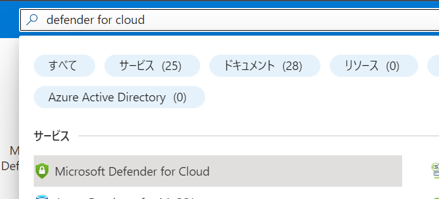
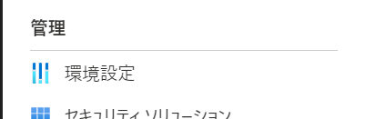
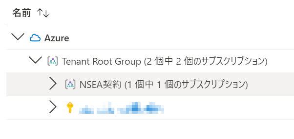
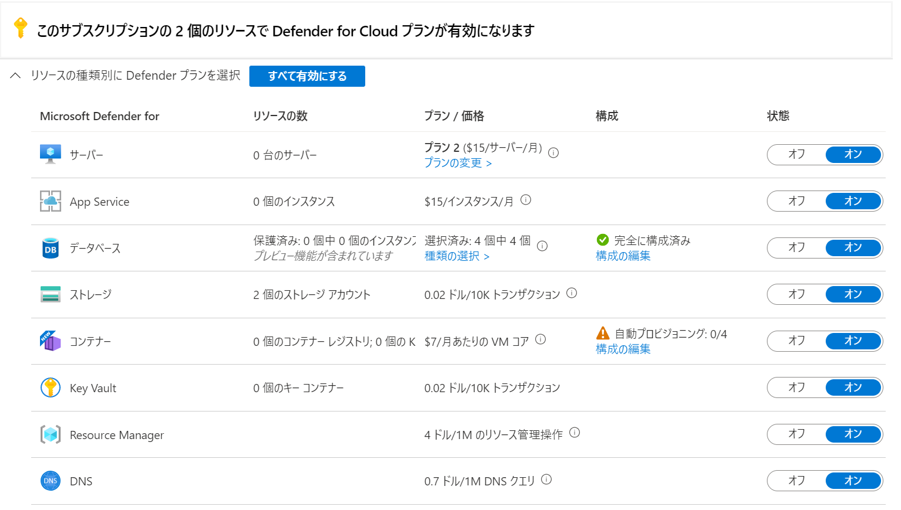
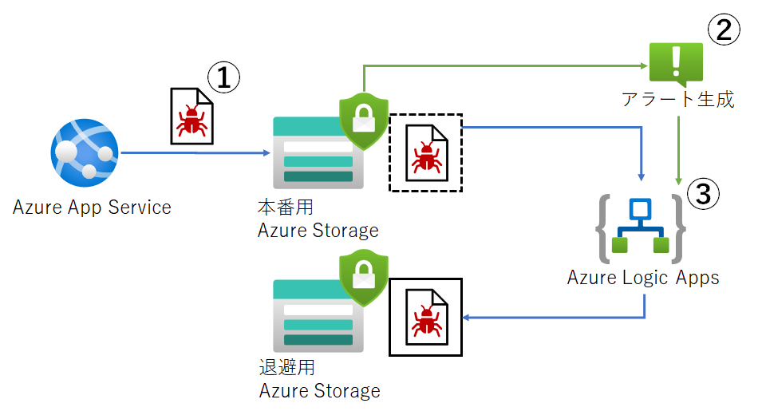

# 付録

- [付録](#付録)
  - [Microsoft Defender for Cloud の有効化](#microsoft-defender-for-cloud-の有効化)
    - [有効化する際の考慮事項](#有効化する際の考慮事項)
    - [有効化手順](#有効化手順)
  - [Microsoft Sentinel](#microsoft-sentinel)
  - [アラート対応の運用改善](#アラート対応の運用改善)
    - [①アラートの抑制](#アラートの抑制)
    - [②アラートに応じた自動ワークフローの設定](#アラートに応じた自動ワークフローの設定)
      - [自動ワークフローの例](#自動ワークフローの例)
  - [DDoS 対策について](#ddos-対策について)

## Microsoft Defender for Cloud の有効化

### 有効化する際の考慮事項

Microsoft Defender for Storage や Microsoft Defender for SQL はリソース単位での有効化も可能ですが、基本的にはサブスクリプション単位で Microsoft Defender for Cloud を有効化することをお勧めします。セキュリティ対策に濃淡があれば手薄な箇所から攻撃されるからです。

### 有効化手順

① [Azure Portal](https://portal.azure.com/#home) に移動します。

② 上部の検索欄に" Microsoft Defender for Cloud "と入力し、出てきたアイテムをクリックします。

③ Microsoft Defender for Cloud の画面に遷移後、サブメニューから環境設定をクリックします。

④ 有効にしたいサブスクリプションをクリックします。

⑤ リソース種別毎にオンオフが可能です。リソース単位でオンオフをしたい場合、ここではオフにしておいて対象のリソースのセキュリティ設定のページからオンにします。

⑥ 設定を変更したら保存ボタンを必ずクリックします。

更に詳しく知りたい方は下記のリンクを参照してください。

[クイックスタート: 強化されたセキュリティ機能を有効にする](https://docs.microsoft.com/ja-jp/azure/defender-for-cloud/enable-enhanced-security)

## Microsoft Sentinel

Microsoft Sentinel は Microsoft Defender for Cloud と機能が似ていますがさらにたくさんの機能があります。  
 Microsoft Defender for Cloud よりも多くの製品のログを収集し、解析でき、脅威に対するアクションを自動で行うことができます。  
詳しくは以下のリンクをご覧ください。

[Microsoft Sentinel とは | Microsoft Docs](https://docs.microsoft.com/ja-jp/azure/sentinel/overview)

Microsoft Defender for Cloud と Microsoft Sentinel を連携させることで、組織としてより広い範囲のセキュリティ対策を行えます。

[Microsoft Defender for Cloud アラートを Microsoft Sentinel に接続する | Microsoft Docs](https://docs.microsoft.com/ja-jp/azure/sentinel/connect-defender-for-cloud)

## アラート対応の運用改善

運用担当者はアラートや通知に対して確認と対応を行う必要がありますが、その中には対処が不要なものが含まれることもあります。  
そのようなアラートに対しては次のことを検討しましょう。

### ①アラートの抑制

[Microsoft Defender for Cloud の警告抑制ルールを使用して誤検知やその他の望ましくないセキュリティアラートを抑制する | Microsoft Docs](https://docs.microsoft.com/ja-jp/azure/defender-for-cloud/alerts-suppression-rules)

アラートを抑制すればその分脅威に対しての有効性が低下します。抑制する際はその影響を慎重に検討すべきです。  
アーキテクチャやアプリケーションに変更があれば抑制したアラートを再度有効にすべき場合もあります。長期的な運用を視野に入れ、定期的に必要性を確認しましょう。

### ②アラートに応じた自動ワークフローの設定

Microsoft Defender for Cloud のアラートをトリガーにしてワークフロー（Azure Logic Apps）と統合できます。  

[クラウドトリガーに対する Microsoft Defender への応答を自動化する](https://docs.microsoft.com/ja-jp/azure/defender-for-cloud/workflow-automation)

Microsoft Defender for Cloud のアラートをトリガーにしてチャットやメール等でのチームメンバーへの通知や、作業タスクの生成、その他様々な運用アクションをワークフローで自動化することができます。  

#### 自動ワークフローの例

Microsoft Defender for Cloud のアラート内容に適応させた自動ワークフローの例をご紹介します。  
Microsoft Defender for Storage のマルウェア検知のアラートの場合、周囲に影響が広がる前にマルウェアファイルを別のストレージに退避させ、削除するワークフローを作成し設定することが可能です。

① 本番用の Azure Storage にマルウェアファイルがアップロードされる  
② Microsoft Defender For Storage がマルウェアファイルを検知し、アラートを生成する  
③ アラートによってトリガーされたワークフローが、マルウェアファイルを本番用 Azure Storage から退避用 Azure Storage に退避する

## DDoS 対策について

Azure Front Door には DDoS 対策の機能（ DDoS Protection Basic ）が含まれているため、 Azure Front Door を利用するだけで DDoS に対する脅威から保護されます。  
DDoS Protection Basic は Azure 標準の DDoS 対策機能で、 Azure が提供するサービスに一律に無償で提供されています。  

有償プランの DDoS 対策機能である Azure DDoS Protection Standard については下記をご確認ください。  
[Azure DDoS Protection Standard の概要](https://docs.microsoft.com/ja-jp/azure/ddos-protection/ddos-protection-overview)
